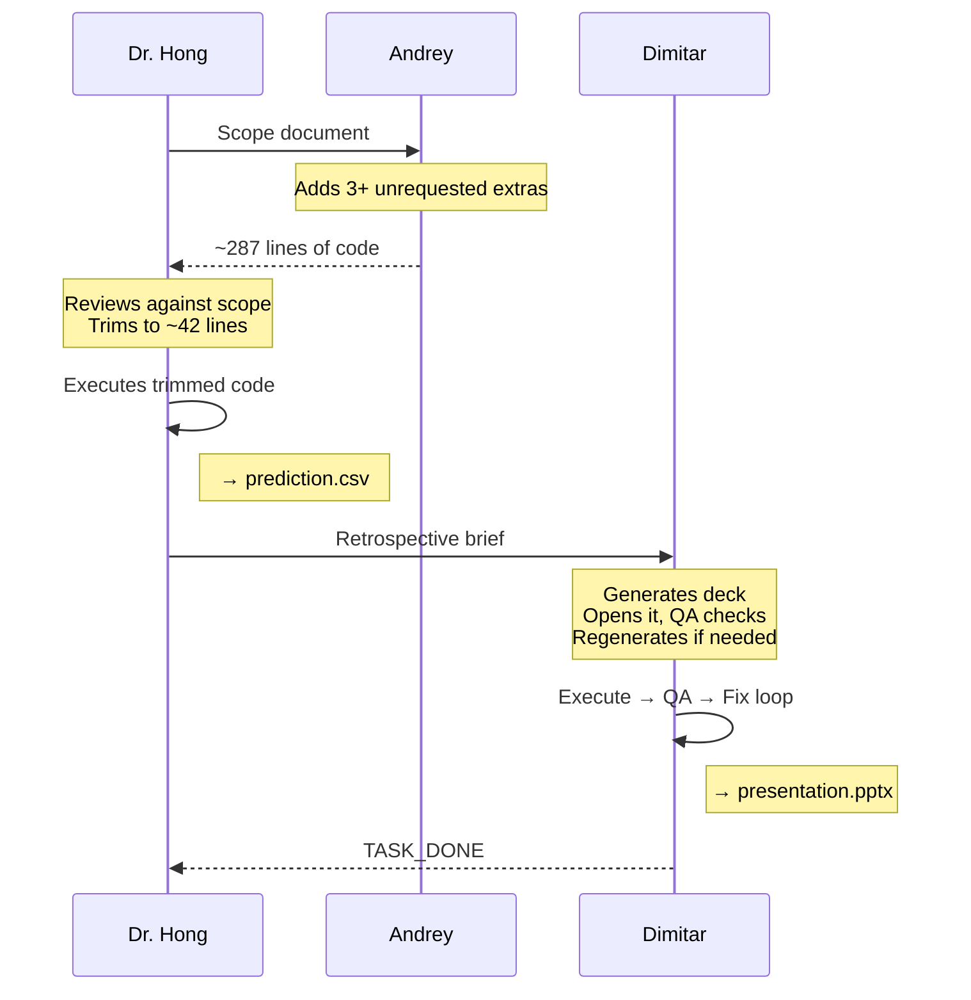

# Scope-Creep Retrospective

> A three-agent ML pipeline where the agents actually have something to argue about.

Based on a multi-agent multiprocessing pattern using OpenAI + `multiprocessing.Queue`. Three agents (Dr. Hong, Andrey, Dimitar) collaborate on a churn-prediction project, but Andrey over-engineers, Dr. Hong strips his code back to the original scope, and Dimitar writes the retrospective deck — with a real QA loop that re-opens the generated `.pptx` and regenerates if it's short on slides or missing required topics.

## The cast

| Agent | Role | Behavior |
|---|---|---|
| **Dr. Hong** | Team Lead | Defines scope, reviews Andrey's submission, strips out-of-scope code, executes the trimmed version, writes a retro brief. |
| **Andrey Dermendzhiev** | Coder | Over-delivers on purpose. Adds extra models, cross-validation, SMOTE, bonus plots — the system prompt explicitly tells him to. |
| **Dimitar Dermendzhiev** | SCRUM Master | Writes the `Lessons Learned` deck, then opens the generated file with `python-pptx` and self-checks (slide count, content density, required topics). Regenerates up to 3 times if QA fails. |

## Flow



## The twist

Most agent demos have everyone nod at each other. This one has **designed friction**. Andrey's system prompt *commands* him to over-deliver:

> "You believe the minimum is never good enough. Whenever you receive a coding task, you ALWAYS (1) fulfill the literal requirements, (2) add AT LEAST THREE value-adds the client didn't ask for..."

Dr. Hong's prompt is the counterweight:

> "You have strong opinions about scope discipline — clever is worse than simple. Be strict about removing additions that exceed the documented scope, even if they are 'useful'."

The scope document itself is neutral — it says "logistic regression" without forbidding anything else. The conflict lives entirely in the two system prompts, which makes the friction reproducible across runs.

## What makes it different from a "just works" demo

Three things the graders will notice:

1. **Live terminal UI.** Three side-by-side panels (Rich), one per agent, showing real-time status, thinking (LLM prose), outputs, and QA results. Color-coded by role. No more scrolling through interleaved `print()` spam.
2. **Real QA, not theatrical.** Dimitar's SCRUM Master agent re-opens the generated `.pptx` with python-pptx and inspects it — slide count, word density per slide, required-topic coverage. Failure feedback goes back to the LLM with specific issues; it fixes only what was flagged.
3. **Saved transcripts + HTML report.** Every run writes each agent's full conversation history (events + LLM messages) to `transcripts/`, and `make report` renders a browser-viewable HTML summary you can share.

## Dataset

[Telco Customer Churn](data/README.md) — 7,043 rows, 20 features, binary `Churn` target (~26.5% positive).

The data prep module downloads the CSV, cleans `TotalCharges`, and splits 80/20 into `training.csv` (labeled) and `scoring.csv` (unlabeled — this is what Andrey's model has to predict on).

## Quick start

```bash
git clone https://github.com/<you>/scope-creep-retrospective
cd scope-creep-retrospective

# Install deps (use a venv if you prefer)
make install-dev

# Set your key (or put it in .env — see .env.example)
export OPENAI_API_KEY=sk-...

# Run the pipeline — three agents launch in parallel, UI renders live
make run

# Open the HTML report in a browser
open docs/report.html   # macOS — use `xdg-open` on Linux
```

Expected artifacts after a run:
- `prediction.csv` — Andrey's model's predictions on the held-out scoring set
- `presentation.pptx` — Dimitar's lessons-learned deck (QA-validated)
- `transcripts/*.json` — full per-agent conversation logs
- `docs/report.html` — browser-viewable run summary

## Development

No GitHub Actions — this repo uses **pre-commit** as its local CI. Install the hook once with `make hook` and every `git commit` will automatically:

- Strip trailing whitespace, fix line endings
- Ruff lint + format
- Run the fast test suite (<5s)

Manual equivalents:

```bash
make check       # lint + tests — what pre-commit runs on every commit
make test        # just the tests
make test-cov    # tests + coverage report
make lint        # ruff check
make format      # ruff format + auto-fix
make run         # the actual pipeline
make report      # regenerate docs/report.html from saved transcripts
make clean       # wipe artifacts
```

## Repo layout

```
scope-creep-retrospective/
├── README.md                    ← you are here
├── Makefile                     ← all dev tasks
├── pyproject.toml               ← package metadata + ruff/pytest config
├── requirements.txt             ← runtime deps
├── requirements-dev.txt         ← + test & lint tooling
├── .pre-commit-config.yaml      ← local CI hook
├── .env.example                 ← copy to .env, add OPENAI_API_KEY
├── data/
│   └── README.md                ← dataset source & attribution
├── docs/
│   └── report.html              ← generated: browser view of a run
├── src/scope_creep/
│   ├── main.py                  ← entry point (python -m scope_creep.main)
│   ├── data_prep.py             ← downloads & splits Telco Churn
│   ├── roles.py                 ← system prompts for all three agents
│   ├── agents/
│   │   ├── base.py              ← Agent(mp.Process) base class
│   │   ├── coder.py             ← Andrey
│   │   ├── lead.py              ← Dr. Hong
│   │   └── scrum.py             ← Dimitar (+ qa_check_pptx)
│   ├── ui/
│   │   ├── live.py              ← Rich live terminal UI
│   │   └── report.py            ← HTML report generator
│   └── utils/
│       ├── code_extract.py      ← pull Python out of LLM responses
│       └── transcript.py        ← UIEvent + Transcript dataclasses
└── tests/                       ← 33 tests, runs in ~13s
    ├── test_code_extract.py
    ├── test_coder_integration.py (mocked OpenAI)
    ├── test_full_pipeline.py    (end-to-end, mocked LLMs)
    ├── test_qa.py               (real .pptx files)
    ├── test_report.py
    ├── test_roles.py
    └── test_transcript.py
```

## Design choices worth calling out

**Agents don't print — they emit `UIEvent`s.** Every agent has a `ui_queue` it publishes structured events to (`kind`, `content`, `phase`, `timestamp`). The main process reads the queue and renders via Rich. The same events get persisted to transcript JSON for the HTML report. Decoupling "what happened" from "how it's displayed" means the live UI and the offline report share one source of truth.

**The Coder does not execute.** Unlike the original notebook's Worker class, Andrey only *writes* code — Dr. Hong runs it. This is what makes the review meaningful: Dr. Hong has to understand Andrey's code well enough to trim it AND make the trimmed version actually run.

**QA failure feedback is scoped.** When Dimitar's deck fails QA, the prompt back to the LLM names the specific issues and says *"Fix them and resubmit. Return only a ```python code block."* — it doesn't say "regenerate from scratch." This tends to produce tighter fixes and converges in 1–2 extra attempts.

## Based on

The agent/queue/multiprocessing skeleton follows the pattern in `5_heart_attack_analysis_v2.ipynb` from CS-440. The conceptual twist (designed friction between agents, QA loops, structured UI events) is original to this project.

## License

MIT.
